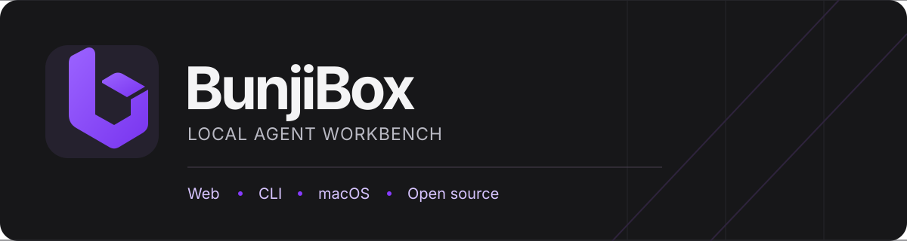
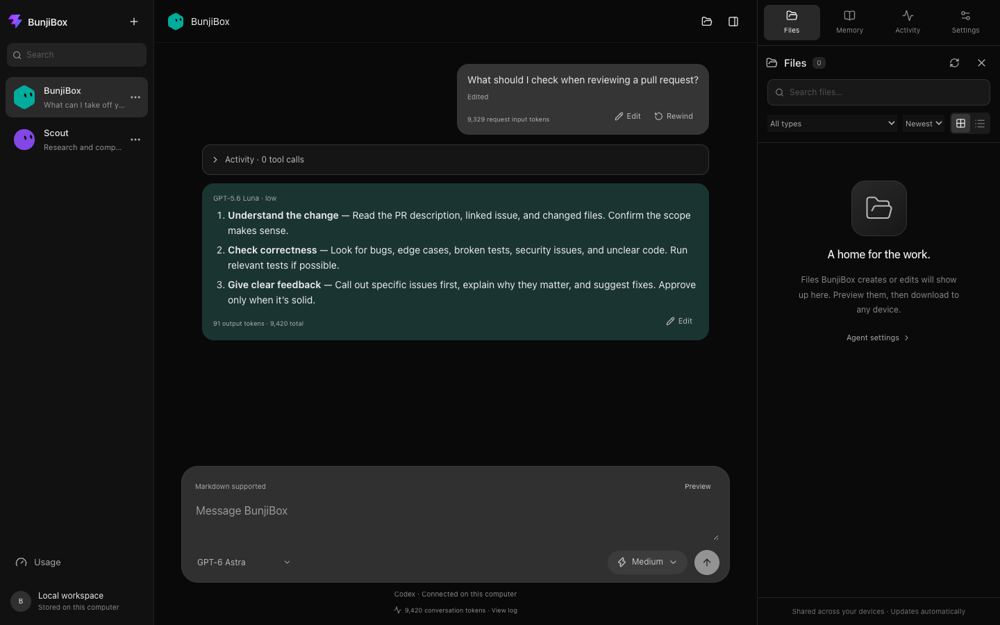
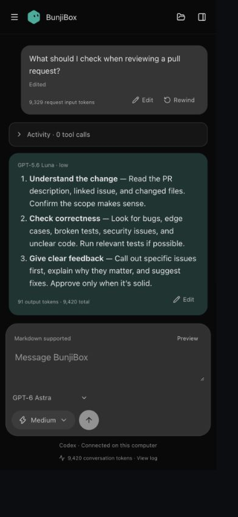

<p align="center">
  
</p>

<p align="center">
  <a href="https://github.com/bakerheit/BunjiBox/actions/workflows/ci.yml"></a>
  &nbsp; <a href="LICENSE">MIT license</a>
  &nbsp; · &nbsp; <a href="CONTRIBUTING.md">Contribute</a>
  &nbsp; · &nbsp; <a href="SECURITY.md">Security</a>
</p>

BunjiBox is an open source agent workbench with a web app, terminal client, and
native macOS client. It connects to locally signed-in Codex and Claude CLIs,
OpenRouter with a user-provided API key, and an optional Ollama server.

The clients share a local workspace and a single provider runtime. BunjiBox is
under active development. See the [contribution guide](CONTRIBUTING.md),
[security policy](SECURITY.md), and [MIT license](LICENSE).
Chats are stored locally; requests sent to hosted providers leave your network.

## Screenshots

These show the web client in a disposable local workspace with a sample PR
review exchange. The phone view uses the same conversation and workspace.

**Desktop workbench**



**Phone view**



## Platform support

macOS is the supported host platform today. The native client, computer
controls, and in-app OpenRouter key storage use macOS APIs. The Node-based
server and clients may work elsewhere, but other operating systems are not yet
supported or covered by CI. On any host, `OPENROUTER_API_KEY` can supply a key
without using the in-app key store.

## Quick start

On a supported macOS host, install Node.js 22.18 or newer and npm. Sign in to
at least one provider with `codex login` or `claude auth login`, or configure
OpenRouter or Ollama as described below. The native client also needs Swift
Package Manager.

```bash
git clone https://github.com/bakerheit/BunjiBox.git
cd BunjiBox
npm ci
npm run api
```

In another terminal, run `npm run dev` and open `http://localhost:5173/`.
For a terminal-only start, use `npm run bunji`. The API listens on
`127.0.0.1:4318`; keep both terminals running for the web app.

## Repo layout

npm workspaces, one lockfile, no build graph tool. Workspace packages are marked
private because they are not published to npm. Everything except the Swift app
and `experiments/` is TypeScript. Node runs the `.ts` files directly with its
built-in type stripping, so the server, CLI, and packages have no build step;
`npm run typecheck` checks types and Vite builds the two web apps.

```
apps/app       @bunji/app      workbench UI (Vite + React)
apps/macos     Swift Package   native SwiftUI macOS app
apps/site      @bunji/site     marketing site, same stack as the app
apps/server    @bunji/server   local-only HTTP bridge on 127.0.0.1:4318
apps/cli       @bunji/cli      the `bunji` terminal app
packages/core  @bunji/core     Node-only runtime and stores
packages/shared @bunji/shared  browser- and Node-safe bot shapes, clients, token math
packages/ui    @bunji/ui       design tokens shared by the app and the site
```

Dependencies only ever point downward: apps depend on packages, `core` depends
on `shared`, and `shared` depends on nothing. The root package owns the `bunji`
bin so `npm link` keeps working. See [docs/architecture.md](docs/architecture.md)
for how requests, storage, and the security boundaries fit together.

## Run it

### Terminal app

Requires Node.js 22.18 or newer and locally installed `codex` / `claude` CLIs.

```bash
npm ci
npm link
bunji
```

Or run `npm run bunji` directly from this folder. The terminal app runs on its
own; it starts the shared Bunji API when needed and does not need Vite. It uses a full-screen buffer,
resizes with the terminal, and restores the shell when you exit.

`bunji --demo` previews the interface offline with clearly labeled sample
activity. `bunji --help` lists options, including `--provider`, `--model`,
`--effort`, `--cwd`, and `-p "prompt"` for scripts (`--json` streams events).

| Key | Action |
| --- | --- |
| Enter / Ctrl+J | Send / insert newline |
| Tab / Escape | Change pane / return to composer |
| Ctrl+K | Search commands |
| Ctrl+B / Ctrl+N | Switch / create bot |
| Ctrl+G / Ctrl+E | Model picker / effort slider |
| Ctrl+T / Ctrl+L | Expand tool activity / token log |
| Ctrl+U / Ctrl+O | Subscription usage / bot details |
| Ctrl+P | Markdown preview |
| PgUp / PgDn | Scroll chat or focused panel |
| Ctrl+X / Ctrl+C | Stop request / exit |

Use `/name`, `/description`, `/color`, and `/shape` to customize a bot. Bots and
avatars are shared with every browser connected to the host computer, in
`~/.config/bunji/workspace.sqlite` (or `$XDG_CONFIG_HOME/bunji/workspace.sqlite`).
`BUNJI_DATA_DIR` overrides this directory; the web backend and CLI must use the
same value. Changes sync roughly every two seconds, without replacing other
devices' unrelated edits. Terminal avatars use a glyph/color fallback for images.

The old CLI config is imported once and retained. Old browser bots/avatars import
when that browser next connects; conflicting copies are kept as recovered bots.
Refresh old browser tabs and restart old CLI processes to load the new sync code.
The workspace is stored on the host computer, not in a cloud account. A phone
must be able to reach that host to connect. Workspaces on different computers
do not sync automatically.

New chat messages, tool activity, and token counts are **saved and shared** across
the web app and interactive CLI. Closing a client does not stop a running request.
Use Stop or Ctrl+X to cancel. The same bot keeps its history when you switch models.
Finished user messages and replies can be edited in the web app. Edits sync to
other devices and shape future context; earlier replies do not regenerate, and
their token counts remain those of the original provider run.
Recent completed exchanges are included within a 12,000-character application
prompt cap; the log reports omitted exchanges. Older messages stay on disk.
`bunji -p` is still a stateless one-shot command. Old in-memory-only chats are not
retroactively recovered. The shared service owns the working directory;
`--cwd` cannot silently change an already running service.

Provider runs have no wall-clock timeout. A long research or tool run can keep
going until it finishes or you stop it. Deployments that want an idle watchdog
can set `BUNJI_PROVIDER_STALL_TIMEOUT_MS`; provider output and diagnostics reset
that timer.

### Web app

```bash
npm run api
npm run dev -- --host 0.0.0.0
```

Open `http://localhost:5173/` on the host, or its local network address on a
phone connected to the same trusted network.

The Vite server proxies `/api` to the local-only bridge on `127.0.0.1:4318`.

### Native macOS app

The native SwiftUI client shares Bunji's local API and workspace with the web
app and CLI. It includes the agent sidebar, continuous chat, Markdown replies,
tool activity, honest token usage, automatic tool routing, model selection,
and the effort slider without embedding a WebView.

```bash
npm run macos:build
npm run macos:app
open apps/macos/dist/BunjiBox.app
```

It can start the local Bunji API from this repository when needed. This alpha
build uses Swift Package Manager and ad-hoc signing; full Xcode will be needed
later for an app icon catalog, hardened runtime, notarization, and distribution.

### Marketing site

```bash
npm run dev:site
```

Opens on `http://localhost:5174/`, so it can run alongside the workbench. It is
the same stack as the app — Vite, React, Tailwind v4, shadcn, lucide — and pulls
its colours from `@bunji/ui`, so the two cannot drift apart. `npm run build:site`
emits a static bundle to `apps/site/dist`.

Its test SSR-renders the page and cross-checks concrete claims (paths, model
names, env vars) against this README, so editing one without the other fails.

### Agent files and right sidebar

The right sidebar opens to **Files**, with compact tabs for **Memory**, **Activity**
(tool calls and tokens), and **Settings**. Computer access is in Settings;
appearance controls expand when needed. On phones, the folder icon opens the
same sidebar as a drawer.

Files use a large-icon grid or compact list, with search, type filters, and sorting.
Click a file for an image, Markdown, or text preview; download it to the device
you are using. Other formats can be downloaded and opened in their own apps.
Previews read up to 128 KB; downloads return the entire original file.

For shared web/interactive-CLI runs with computer writes enabled, Bunji indexes
successful Codex file changes and Claude Write/Edit calls. New standalone
deliverables default to `outputs/<bot-id>/<request-id>/` in the Bunji data
directory, or `.bunji/outputs/<bot-id>/<request-id>/` inside a selected folder.
These output folders are checked while the agent works and when it finishes.
Agents also get a `files_publish` tool to register files generated elsewhere,
including shell output. Local Markdown download links in their replies are
captured too. Files made elsewhere need a publish call or a reply attachment
to appear; Bunji does not scan the whole machine.

The index persists in the shared workspace and syncs to connected devices.
Older completed file-write events and reply attachments with absolute paths are
recovered when the service starts; old relative paths or truncated logs cannot be recovered reliably.
The browser only serves registered file IDs. HTML and SVG are text previews,
not executable pages. Files moved or removed outside Bunji are marked unavailable.
Deleting an agent does not delete its created files from disk.

## Runtime controls

- Claude: Opus, Sonnet, or Haiku; low through max effort.
- Codex: GPT-6 Astra, GPT-5.6 Sol, Terra, Luna, or GPT-5.5; model-specific effort options.
- OpenRouter: the free-model or automatic router; low through high effort. Add or replace the API key on the Usage page. BunjiBox verifies it with OpenRouter and stores it in macOS Keychain, never browser storage.
- Ollama: Gemma3 1B; the temporary connector runs it in chat mode.
- Bot names, descriptions, avatars, provider, model, effort, and default run mode persist in the
  shared workspace, not per-browser storage. Failed saves show a warning and retry.
- Settings or the sidebar’s three-dot menu can delete an agent and its chat history. If it has memory notes,
  choose another agent to receive them or delete the notes. Linked notes are
  remapped during transfer. A running request must finish or be stopped first.
- **Auto** is the default for new agents. Bunji routes obvious tool work directly
  to Agent; other messages start in Chat and let the selected model request an
  Agent handoff. The composer previews that choice and lets you override it.
  Auto never expands the computer permissions already saved for that agent.
- **Chat** mode is the lean path: Bunji memory, files, and computer tools are off.
  OpenRouter and Ollama are Chat-only in this alpha. Codex Chat uses the signed-in
  Codex CLI with user configuration, project instructions, skills, and tool features
  disabled where the CLI permits; this is not ChatGPT consumer chat or API access.
  Claude Chat uses the signed-in Claude Code CLI in safe mode with no tools.
- **Agent** mode keeps Bunji's full harness. Codex keeps its computer sandbox;
  Claude uses a restricted built-in tool set without shell or edits while memory
  tools are available. Codex Agent runs use Bunji's lean profile, which skips
  host plugins, apps, memories, hooks, and unrelated tool systems. Each saved
  request records both the requested and resolved mode.
- Each bot can also keep a shared computer profile: no computer, a selected
  folder, or This Mac full access. Selecting full access shows a confirmation
  modal; no device pairing is required. Folder changes run through Codex's
  `workspace-write` sandbox; This Mac runs unrestricted through either provider.
  See [computer access
  design](docs/computer-access.md).

## Shared runtime and sign-in

The terminal and HTTP bridge share `packages/core/src/runtime.ts`: provider
commands, model/effort validation, login checks, activity streams, and token
accounting. Subscription meters share `packages/core/src/usage.ts`. The browser
model catalog is also used by the terminal. No second copy of the agent runner
is needed.

Run `codex login` or `claude auth login` to connect the corresponding provider.
The app checks current login status; no account state is hard-coded.

Codex Agent requests use one-shot CLI runs by default. Durable Codex app-server
threads are experimental and Agent-only. To test them, start the API with
`BUNJI_EXPERIMENTAL_CODEX_APP_SERVER=1 npm run api`. Chat stays stateless, and
edits, rewinds, agent deletion, or a changed identity/computer policy invalidate
the saved app-server thread before the next turn.

OpenRouter uses its HTTPS chat-completions API. Add a key from the Usage page,
or set `OPENROUTER_API_KEY` before starting the local service. Direct OpenRouter
chat and token accounting work in this alpha; Bunji memory, computer, and file
tools are not exposed to OpenRouter models yet.

Ollama defaults to `http://127.0.0.1:11434`. Set `BUNJI_OLLAMA_URL` before
starting BunjiBox to use an Ollama server on another trusted host. For example,
`BUNJI_OLLAMA_URL=http://192.168.1.10:11434 npm run api`.
Keep that endpoint on a trusted network; BunjiBox does not add authentication to
the Ollama connection.

This is a LAN-only alpha. Do not expose the dev server to the public internet.
There is no account or device authentication: anyone who can reach the web app
on your network can enable full access and send commands through a bot. Use only
on a trusted network.

The local API only answers requests addressed to an IP address, `localhost`, or
a `*.localhost` name, the same default as the Vite dev server. This blocks DNS
rebinding from web pages you visit. If you reach BunjiBox through another host
name that you also added to Vite's `server.allowedHosts`, list it in
`BUNJI_ALLOWED_HOSTS` before starting the API, for example
`BUNJI_ALLOWED_HOSTS=studio.lan npm run api`. A leading dot, such as `.lan`,
also allows its subdomains.

## Ongoing conversations and agent memory

Open the Memory tab in the agent sidebar to browse, create, edit, and follow linked Markdown
notes. Memory lives in `~/.config/bunji/memory/<bot-id>/` (or your configured data
directory), with stable `[[note-id|Title]]` links and source message IDs.

Agents can search, read, and save useful notes in Agent-mode shared chats. Just ask
the agent to remember something, or let it capture a durable preference or
decision when relevant. In Bunji, `/memory [search]`, `/recall <note-id>`, and
`/older` help you browse history; `/remember <text>` still works as an alias.

Notes are not saved from every message. They are plaintext;
do not save secrets. Only relevant retrieved notes go to the selected provider.
See [the continuity design and alpha limits](docs/agent-continuity.md) for storage,
permissions, recovery, context budgeting, and what is not implemented yet.
